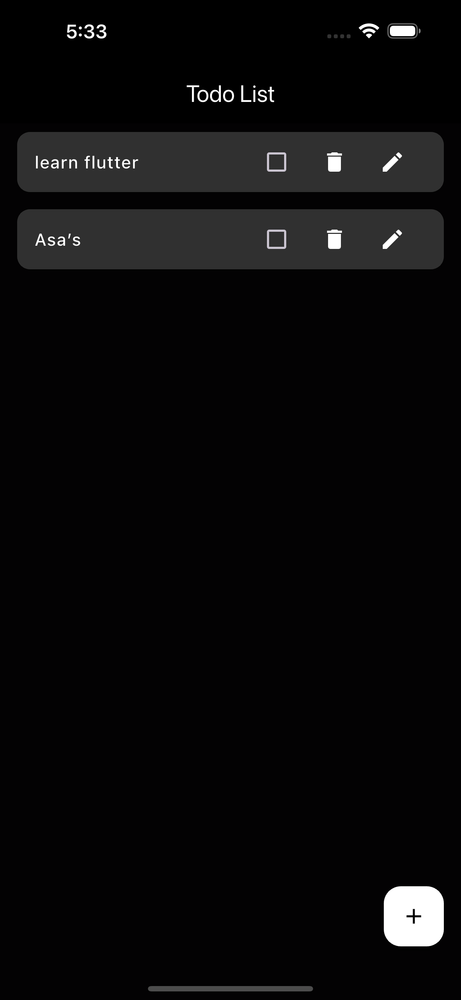
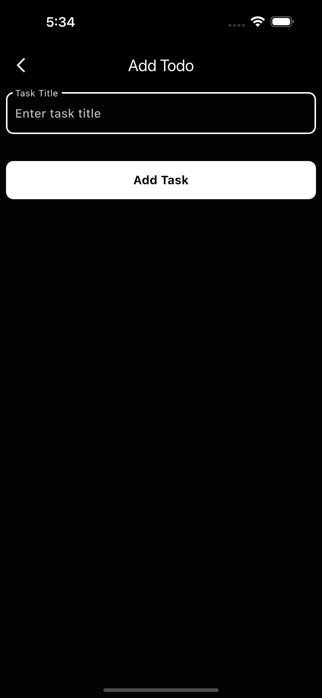

# Todo Application

A simple Todo application built with Flutter that allows users to add, update, delete, and check off tasks. This app features a dark mode interface for better usability in low-light environments.

## Features

- Add new tasks
- Edit existing tasks
- Delete tasks
- Mark tasks as completed
- Dark mode theme

## Technologies Used

- **Flutter**: The framework for building natively compiled applications for mobile, web, and desktop from a single codebase.
- **Provider**: State management solution for Flutter to manage application state efficiently.
- **Dart**: The programming language used to write the application.

## Installation

1. **Clone the repository:**

   ```bash
   git clone https://github.com/your-username/todo_application.git
   ```

2. **Navigate to the project directory:**

   ```bash
   cd todo_application
   ```

3. **Install dependencies:**

   ```bash
   flutter pub get
   ```

4. **Run the application:**

   ```bash
   flutter run
   ```

## Usage

- Launch the app on your device or emulator.
- To add a new task, tap the "+" button located in the bottom right corner.
- Enter the task title and click "Add Task" to save.
- You can tap on the task to edit it, mark it as completed, or delete it.

## Screenshots

  
  

## Contributing

Contributions are welcome! If you have suggestions for improvements or want to add new features, feel free to fork the repository and submit a pull request.


## Acknowledgments

- Inspired by various open-source projects and resources.
- Thanks to the Flutter community for their support and contributions.
